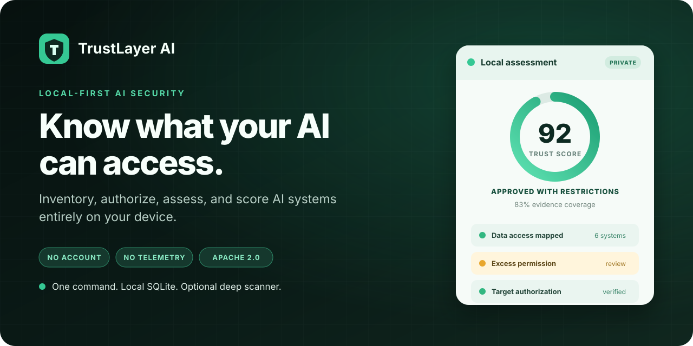
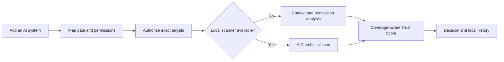

<p align="center">
  
</p>

<p align="center">
  <strong>Turn AI access, permissions, and security evidence into one explainable trust decision.</strong><br />
  Runs on your machine. No account. No cloud database. No telemetry.
</p>

<p align="center">
  <a href="https://github.com/ayush-singh-0601/trustlayer-ai/actions/workflows/ci.yml"></a>
  <a href="LICENSE"></a>
  
  
  <a href="https://github.com/ayush-singh-0601/trustlayer-ai/stargazers"></a>
</p>

<p align="center">
  <a href="#-quick-start">Quick start</a> ·
  <a href="#-what-trustlayer-does">Features</a> ·
  <a href="#-how-it-works">How it works</a> ·
  <a href="#-optional-deep-scanning">Scanner</a> ·
  <a href="CONTRIBUTING.md">Contribute</a>
</p>

---

Most AI security tools tell you whether a model or endpoint is technically vulnerable. TrustLayer adds the context needed to decide whether that AI should be trusted inside a real organization:

- **What can it access?** Data categories, connected systems, and current permissions.
- **What does it actually need?** Required permissions and business purpose.
- **How strong is the evidence?** Coverage-aware findings from context analysis and optional technical scans.
- **What should happen next?** A deterministic Trust Score and an explainable decision.

Everything is persisted to a local SQLite database and served only on loopback.

## ⚡ Quick start

**Requires [Node.js 22.16+](https://nodejs.org/). Docker is optional.**

### Windows

```powershell
git clone https://github.com/ayush-singh-0601/trustlayer-ai.git
Set-Location trustlayer-ai
.\run.ps1
```

### macOS or Linux

```sh
git clone https://github.com/ayush-singh-0601/trustlayer-ai.git
cd trustlayer-ai
sh ./run.sh
```

That is it. The launcher installs missing packages, builds changed source, opens `http://localhost:3000`, and stores your data in `.trustlayer/trustlayer.db`.

> [!NOTE]
> No Docker? TrustLayer still performs business-context and excess-permission analysis. Technical coverage is marked incomplete instead of pretending a deep scan happened.

## What TrustLayer does

| Capability | What you get |
| --- | --- |
| **AI inventory** | One place to record AI services, agents, model endpoints, MCP servers, owners, purpose, and criticality. |
| **Access mapping** | A clear view of connected systems, sensitive data, current permissions, and required permissions. |
| **Permission analysis** | Deterministic findings when an AI can read, write, send, delete, execute, or export more than its job requires. |
| **Authorized assessment flow** | Exact-target authorization, idempotent runs, URL credential rejection, and metadata/link-local safety blocks. |
| **Trust Score** | A reproducible score, decision gate, finding breakdown, and explicit evidence coverage. |
| **Local history** | Assets, authorizations, findings, and completed assessments survive restarts in embedded SQLite. |
| **Optional deep scans** | Tencent AI-Infra-Guard results normalized behind a scanner-neutral adapter. |

## How it works



The scoring engine is deterministic and versioned. Identical findings and business context produce the same result; missing evidence lowers coverage and prevents a misleading approval.

## Two useful modes

| Mode | Setup | Best for |
| --- | --- | --- |
| **Context-only** | Node.js only | Inventory, access review, permission analysis, and evaluating the workflow. |
| **Deep scan** | Node.js + Docker | Authorized technical assessment of supported agents, infrastructure, MCP servers, and model endpoints. |

## Optional deep scanning

TrustLayer uses [Tencent AI-Infra-Guard](https://github.com/Tencent/AI-Infra-Guard) as an optional local scanning engine. AIG is not the TrustLayer backend and is never exposed through the TrustLayer web app.

```sh
npm run scanner:start
npm start
```

The pinned scanner runs on `127.0.0.1:8088`. Check it with `npm run scanner:status` and stop it with `npm run scanner:stop`.

> [!CAUTION]
> The AIG agent container requires elevated Docker permissions. Review `compose.yaml`, keep the port loopback-only, and scan only systems you own or are explicitly authorized to test.

### Why both projects?

- **AIG** performs low-level technical scanning.
- **TrustLayer** owns inventory, authorization, target safety, business context, normalized evidence, deterministic scoring, and local history.

This boundary lets TrustLayer stay useful without Docker and makes the scanner replaceable through `packages/scanner-sdk`.

## Local architecture

```text
Browser  ──>  Next.js UI  ──>  Fastify API  ──>  SQLite
                                  │
                                  └──> local worker ──> optional AIG containers
```

- UI: `127.0.0.1:3000`
- API: `127.0.0.1:4000`
- Optional AIG: `127.0.0.1:8088`
- Local data: `.trustlayer/trustlayer.db`

See [the architecture notes](docs/architecture.md) for lifecycle and security-boundary details.

## Security principles

- Loopback-only services by default.
- No account, hosted control plane, telemetry, or required API key.
- Explicit authorization before active assessment.
- Public HTTPS and local/private HTTP or HTTPS targets supported.
- Cloud metadata, link-local, multicast, reserved, credential-bearing, and mixed public/private DNS targets rejected.
- Scanner evidence redacted before persistence.

Read [SECURITY.md](SECURITY.md) before testing anything outside your own device.

## Project status

TrustLayer is an early-stage open-source project. The local inventory, authorization, context analysis, deterministic scoring, SQLite persistence, AIG adapter, and cross-platform build are working today.

Good contributions include:

- automated web component and end-to-end tests;
- more scanner adapters behind the neutral SDK;
- richer remediation guidance and export formats;
- packaging that reduces the Node.js prerequisite;
- accessibility, documentation, and first-run UX improvements.

See [CONTRIBUTING.md](CONTRIBUTING.md), open a [feature request](https://github.com/ayush-singh-0601/trustlayer-ai/issues/new?template=feature_request.yml), or start a [discussion](https://github.com/ayush-singh-0601/trustlayer-ai/discussions).

## Development

```sh
npm ci
npm test
npm run typecheck
npm run build
npm audit
```

The same gates run on Windows and Ubuntu in GitHub Actions. Maintainers can additionally verify the exact AIG contract with:

```sh
npm run aig:sync
npm run aig:verify
```

Latest completed verification evidence is recorded in [docs/verification.md](docs/verification.md).

## Frequently asked questions

<details>
<summary><strong>Is this a SaaS product?</strong></summary>

No. TrustLayer runs on your device and has no hosted control plane.

</details>

<details>
<summary><strong>Does it upload my inventory or scan results?</strong></summary>

No TrustLayer component sends your application data to a TrustLayer service. The optional scanner has its own runtime and should be reviewed before use.

</details>

<details>
<summary><strong>Is Docker required?</strong></summary>

No. Docker is required only for optional AIG technical scans. Context and permission assessment works with Node.js alone.

</details>

<details>
<summary><strong>Can I scan localhost and private services?</strong></summary>

Yes. Local and private HTTP or HTTPS targets are supported for self-hosted systems. Metadata and other dangerous address classes remain blocked.

</details>

## License

TrustLayer AI is available under the [Apache License 2.0](LICENSE). Tencent AI-Infra-Guard is a separate Apache-2.0 project and retains its own copyright and license.

---

<p align="center">
  <strong>If TrustLayer makes AI access risk easier to reason about, a ⭐ helps other builders find it.</strong>
</p>
